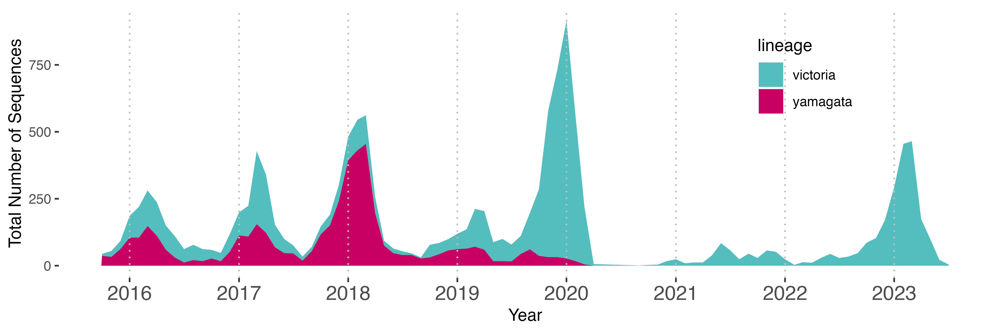
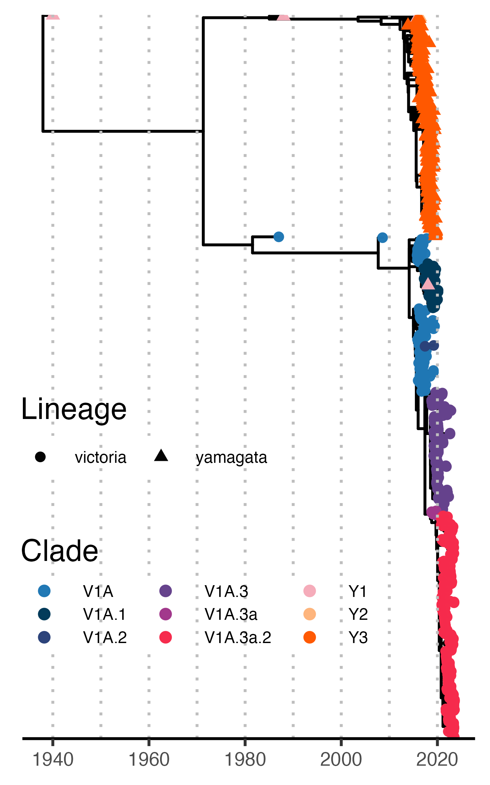

# Figure 1 Scripts

This repository holds scripts for Figure 1 of [Wouters et al., 2024]().

## Methods

Influenza B genomes were accessed from GISAID on ** with the following parameters:
* Date isolated: between October 2015 - January 2023,
* Segment Requirements: 8 segments
* Complete sequence
* Passage History: original

Sequence filtering and down sampling procedures are available in [01_downsample.ipynb](scripts/01_Master.ipynb). Briefly, duplicate sequences were removed using `seqkit rmdup -n`[^1]. Remaining gene segments were parsed with a custom script, [`pyflute.py`](scripts/pyflute.py). Metadata was generated from FASTA headers using `augur parse`[^2]. Quality and clade assignments were performed with `nextclade`[^3]. Metadata from Augur and Nextclade were merged and concatenated for both Victoria and Yamagata lineages. Representative sequences were down sampled to 866 genomes grouping by year and month using `augur filter`. Finally, we aligned sequences using `augur align` and constructed a time-scaled phylogenetic tree with `treetime`[^4]. Lineage frequencies and time scaled trees were visualized using ggplot2[^5], treeio[^6] and ggtree[^7] available in [02_tree_plots](scripts/02_tree_plots.qmd).

## Data Availability

> GISAID Acknowledgement: We gratefully acknowledge all data contributors, i.e., the Authors and their Originating laboratories responsible for obtaining the specimens, and their Submitting laboratories for generating the genetic sequence and metadata and sharing via the GISAID Initiative, on which this research is based. While this article is a review of the current literature in influenza B virus, figure 1 are based on the metadata associated with 13,579 sequences available on GISAID between October 2015 and January 2023. Metadata for sequences used in this manuscript can be found within [gisaid_isolates.tsv](gisaid_isolates.tsv)

# Footnotes
[^1]: Shen, Wei, Botond Sipos, and Liuyang Zhao. 2024. “SeqKit2: A Swiss Army Knife for Sequence and Alignment Processing.” iMeta e191. https://doi.org/10.1002/imt2.191

[^2]: James Hadfield, Colin Megill, Sidney M Bell, John Huddleston, Barney Potter, Charlton Callender, Pavel Sagulenko, Trevor Bedford, Richard A Neher, Nextstrain: real-time tracking of pathogen evolution, Bioinformatics, Volume 34, Issue 23, December 2018, Pages 4121–4123, https://doi.org/10.1093/bioinformatics/bty407

[^3]: Aksamentov et al., (2021). Nextclade: clade assignment, mutation calling and quality control for viral genomes. Journal of Open Source Software, 6(67), 3773, https://doi.org/10.21105/joss.03773

[^4]: Sagulenko P, Puller V, Neher RA. TreeTime: Maximum-likelihood phylodynamic analysis. Virus Evol. 2018 Jan 8;4(1):vex042. doi: 10.1093/ve/vex042. PMID: 29340210; PMCID: PMC5758920.

[^5]: Wickham H (2016). ggplot2: Elegant Graphics for Data Analysis. Springer-Verlag New York. ISBN 978-3-319-24277-4, https://ggplot2.tidyverse.org.

[^6]: Wang L, Lam T, Xu S, Dai Z, Zhou L, Feng T, Guo P, Dunn C, Jones B, Bradley T, Zhu H, Guan Y, Jiang Y, Yu G (2020). “treeio: an R package for phylogenetic tree input and output with richly annotated and associated data.” Molecular Biology and Evolution, 37, 599-603. doi:10.1093/molbev/msz240.

[^7]: Yu, G., Smith, D.K., Zhu, H., Guan, Y. and Lam, T.T.-Y. (2017), ggtree: an r package for visualization and annotation of phylogenetic trees with their covariates and other associated data. Methods Ecol Evol, 8: 28-36. https://doi.org/10.1111/2041-210X.12628